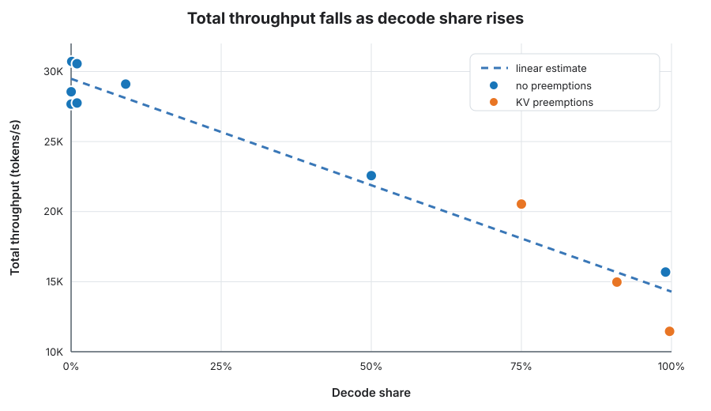

# Decode Share Is a Useful Predictor of DeepSeek-V4-Flash Throughput

Why can the same model serve one workload at 30,000 tokens/s and another at
12,000? Prompt length, output length, concurrency, KV-cache pressure, and
scheduler settings all matter. In a controlled experiment with
**DeepSeek-V4-Flash**, however, one simple quantity explained most of the
throughput variation: **decode share**.

```text
decode share = output tokens / (input tokens + output tokens)
```

Across 11 saturated, fixed-shape workloads on one 8×H100 node, total
throughput fell from about 30,700 tokens/s for almost pure prefill to about
11,500 tokens/s for almost pure decode.



*Each point is one measured run. Orange points incurred KV-cache preemptions.*

## A first-order estimate

A linear fit to these measurements gives:

```text
T(s) = (1 - s) × 29,500 + s × 14,300 tokens/s
```

Here, `s` is decode share. The two endpoint values are regression parameters,
not theoretical limits. On the same 11 measurements used to fit the line, the
model has an R² of 0.94 and a mean absolute percentage error of 7.2%.

For example, a fixed workload with 2,000 input tokens and 1,000 output tokens
has a decode share of one third. The estimate is therefore about 24,400 total
tokens/s. This is useful as a screening estimate: it identifies the likely
throughput regime before running the workload itself.

Representative measurements show the trend:

| Input / output tokens | Decode share | Total tok/s | KV peak | Preemptions |
|---|---:|---:|---:|---:|
| 1,000 / 1 | 0.1% | 30,716 | 4.3% | 0 |
| 1,000 / 100 | 9.1% | 29,103 | 30.0% | 0 |
| 100 / 100 | 50.0% | 22,568 | 99.4% | 0 |
| 1,000 / 3,000 | 75.0% | 20,538 | 100% | 21 |
| 100 / 1,000 | 90.9% | 14,972 | 100% | 76 |
| 100 / 10,000 | 99.0% | 15,684 | 99.2% | 0 |
| 100 / 32,000 | 99.7% | 11,458 | 100% | 15 |

The relationship is plausible because prefill and decode exercise the GPU
differently. Prefill can process many prompt tokens together, while decoding
advances each active request one generated token at a time. The fitted line is
still an empirical summary of this configuration—not a general performance
law.

## Why some workloads miss the line

Decode share predicts the broad regime. KV-cache pressure explains some of the
largest departures from it.

The 100/1,000 workload is less decode-heavy than the 100/10,000 workload, yet
it is slower: 14,972 versus 15,684 tokens/s. The former filled the KV cache and
incurred 76 preemptions; the latter completed without preemption. Preemption
can force the engine to recompute earlier work, spending GPU time on tokens
that are not added again to the logical-throughput numerator.

Length distribution is another important limitation. These measurements use
one fixed input/output shape per run. For a heterogeneous workload, calculate
aggregate decode share as:

```text
sum(output tokens) / sum(input tokens + output tokens)
```

Even then, workloads with the same aggregate share can have different
throughput. Long-tail requests hold scheduler slots during drain, and p95/p99
lengths can matter much more than the mean. The fit should therefore not be
applied to a production distribution by substituting only its mean input and
output lengths.

## Estimating a workload with a shared prefix

Prefix caching was disabled in these experiments, but the no-cache fit can
still provide a first estimate for a workload with a shared prefix. Replace
raw input tokens with the input tokens the model must actually process.

Let `I` be total raw input tokens, `O` total output tokens, and `C` input tokens
served from the prefix cache. Then:

```text
processed tokens       P = I - C + O
effective decode share s = O / P
estimated elapsed time   = P / T(s)
logical throughput       = T(s) × (I + O) / P
```

The last conversion matters because serving metrics commonly count the full
logical prompt even when part of it came from cache. For `N` requests sharing
a stable prefix of `Pprefix` reusable tokens, an initially empty cache gives
`C ≈ (N - 1) × Pprefix`: the first request populates the cache and later
requests reuse it. If the cache is already warm, use `C ≈ N × Pprefix`.

Use the block-aligned reusable prefix—not the raw textual prefix—and reduce
`C` for measured cache misses or eviction. This remains an estimate: enabling
prefix caching can also change KV pressure and scheduler behavior.

## Experimental scope

All runs used DeepSeek-V4-Flash with vLLM 0.29.0 on one 8×H100 node: TP8,
PP1, DP1, with expert parallelism disabled. The server used
`max_num_batched_tokens=4096`, GPU memory utilization 0.92, FP8 KV cache, and
prefix caching disabled. `max_num_seqs` was sized for each shape because long
outputs consume more KV memory. Decode share and affordable concurrency were
therefore coupled in this experiment.

Throughput is measured over the full fire-and-drain window: all logical input
and output tokens divided by elapsed time from the first request to the last
completion. The result includes ramp and drain, making it appropriate for
finite batch jobs but different from steady-state server throughput.

The fitted coefficients should not be transferred unchanged to another model,
GPU topology, scheduler configuration, prefix-cached workload, or request
distribution. These are throughput measurements, not latency measurements;
they do not characterize time to first token or inter-token latency.

## Takeaway

For this DeepSeek-V4-Flash configuration, decode share is a useful first-order
capacity signal: it explains most of the roughly 2× throughput difference
between prefill-heavy and decode-heavy traffic. Use it to choose a plausible
throughput range, then validate that estimate with the actual length
distribution. For shared-prefix traffic, first adjust for cached input tokens.
In both cases, check KV utilization and preemptions before using the estimate
for capacity planning.
