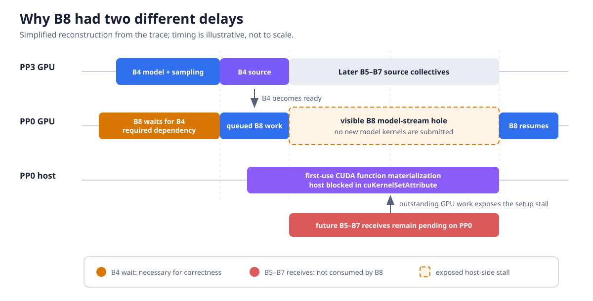

# WIP: How an Early NCCL Receive Turned CUDA Lazy Loading Into Pipeline Bubbles

A small pipeline-parallel feedback message created model-work gaps up to about
a second long. Moving its receiver-side NCCL collective from before the
current batch's model execution to after it eliminated the receive-aligned
gaps in matched profiles—without changing the logical dependency or the
collective order.

The payload was not the problem. The receive was posted early, so its NCCL
kernel could remain resident while it waited for the source stage. That had
two distinct effects:

1. It directly competed with model kernels for GPU resources.
2. By remaining outstanding, it prolonged a host-side CUDA
   lazy-materialization stall until the model stream ran out of queued work.

This post explains how we separated those effects, proved the second one with
a controlled experiment, and fixed the scheduling problem.

The evidence comes from several production traces, including two matched
before/after profile pairs, plus a controlled microbenchmark. All used the
same deployment.

## The surprising pipeline hole

The system used four pipeline-parallel (PP) stages and eight tensor-parallel
(TP) workers per stage on NVIDIA H100 GPUs. The last PP stage sampled a result
that an earlier stage consumed four scheduler steps later. For example, batch
`B8` needed the sampled result from `B4`.

That creates a real dependency:

```text
PP3 finishes B4 sampling
    -> PP3 launches B4's source collective
    -> PP0's matching receive completes
    -> B8 can consume B4's result
```

Waiting for `B4` is necessary. But by the time `B8` ran, the receiver had also
posted the future `B5`, `B6`, and `B7` receives. `B8` did not consume those
values; they were waiting for future source collectives.

This distinction matters because a posted receive is not a passive queue
entry. It launches an NCCL kernel that may remain active until the source rank
joins the collective.



*Figure 1. Simplified reconstruction from the trace. B8 must wait for B4, but
the later internal hole occurs while unrelated future receives remain pending
and the host is blocked in lazy CUDA function materialization. Timing is
illustrative, not to scale.*

In one representative trace, `B8` first waited for its required `B4` result.
Later, it contained a separate 986 ms internal model-work gap. The pending
`B5`-`B7` receiver kernels overlapped essentially the entire gap.

The first delay was a correctness dependency. The second was interference.

## A pending receive slows model kernels

The GPU-side effect came from a sharp occupancy boundary.

A **wave** is the set of cooperative thread arrays (CTAs, or thread blocks)
that a GPU can run concurrently for one kernel. Here, 132 SMs could each host
two Marlin CTAs, so 264 CTAs fit in exactly one wave. Displacing even one CTA
creates an additional tail after the main wave.

On the H100 used in this experiment:

- each streaming multiprocessor (SM) had 233,472 bytes of shared memory;
- the waiting NCCL LL receiver CTA used 119,040 bytes;
- a dominant Marlin model CTA used 115,200 bytes; and
- the Marlin launch contained 264 CTAs, exactly two per SM across 132 SMs.

Two Marlin CTAs fit on one SM:

```text
115,200 + 115,200 = 230,400 bytes
```

One NCCL CTA and one Marlin CTA do not:

```text
119,040 + 115,200 = 234,240 bytes
```

That is only 768 bytes over the limit, but it changes execution from an exact
one-wave placement into a launch with a slower tail.

The traces matched this model. Dominant Marlin kernels had a 131.4 ms median
with no receive overlap and a 199.8 ms median with at least 75% overlap—a 52%
increase measured against the no-overlap median. Receive overlap and Marlin
duration had a correlation of 0.996, with the same pattern on all eight TP
workers of the affected PP stage.

This explains slower model kernels, but it does not yet explain a completely
empty model stream. For that, we had to inspect the host-side CUDA calls.

## The host stopped submitting model work

The large holes lined up with the first appearance of specialized CUDA kernel
variants. The host trace showed this sequence:

```text
cuLibraryLoadData
    -> cuLibraryGetKernel
    -> cuKernelGetAttribute
    -> cuKernelSetAttribute
```

We call this **lazy first materialization**: CUDA has a kernel handle, but the
function has not yet been fully materialized in that process's CUDA context.
A later API call finishes the work on first use.

During the hole, the inference thread remained blocked inside
`cuKernelSetAttribute`. CUDA launches are normally asynchronous, so model
kernels that were already queued continued to run. But the blocked host thread
could not submit the next model kernel. Once the queued work finished, the GPU
model stream became idle.

```text
Host:  enter first-use cuKernelSetAttribute -------- blocked -------- return

GPU:   queued model kernels ========|              idle              | next work
       pending receive ==============================================|
```

The model stream was therefore empty because the host stopped feeding it—not
because `B8` logically depended on the `B5`-`B7` results.

The clearest instance appeared on all eight TP workers of the affected PP
stage. The corresponding `cuKernelSetAttribute` calls began about 310 ms
before the visible gap, lasted about 1.3 seconds, and returned about 0.10-0.12
ms after the final pending receive ended. Already-queued model work hid the
first 310 ms of the host stall; after that work drained, the remainder became
the visible GPU hole.

In a later matched profile, all 96 `cuKernelSetAttribute` calls longer than
100 ms overlapped pending sampled-result receives. Every call returned
0.080-0.161 ms after the final overlapping receive ended.

That timing was strong evidence, but correlation was not enough. The open
question was whether NCCL was special or whether lazy materialization waited
behind outstanding GPU work more generally.

## A controlled experiment isolated the cause

We tested the CUDA operation in fresh processes. Each test started a
1.5-second interfering operation, waited 100 ms, and then measured the API
call. If the call lasted about 1.4 seconds, it had waited for the remaining
interferer lifetime.

| Test arm | Median API time | Interfering work still pending after return? |
|---|---:|:---:|
| Lazy first materialization, no GPU work | 0.039 ms | n/a |
| Lazy first materialization + spin kernel | 1,400.001 ms | No |
| Lazy first materialization + NCCL receive | 1,400.326 ms | No |
| Preloaded function + NCCL receive | 0.003 ms | Yes |
| Eager module loading + NCCL receive | 0.004 ms | Yes |
| Prewarmed kernel launch + NCCL receive | 0.008 ms | Yes |

The preloaded-function arm is a state-based control, not a clean comparison
of `CUkernel` and `CUfunction` locking: obtaining the context-specific
`CUfunction` necessarily materializes it. The arm shows that changing the
attribute after materialization is cheap; it does not isolate the two API
types' internal locking behavior.

The result changed our interpretation:

- NCCL was not uniquely blocking `cuKernelSetAttribute`.
- Lazy first materialization serialized behind both an unrelated compute
  kernel and a pending NCCL receive.
- Attribute mutation was cheap after the function had been materialized.
- A normal prewarmed kernel launch remained asynchronous while the receive was
  pending.

The production and controlled experiments had the same release edge: the
host API returned almost immediately after the outstanding GPU operation
finished.

This establishes the externally visible synchronization behavior. It does
not identify the CUDA driver's exact internal lock or quiescence condition;
that implementation detail remains undocumented.

## The fix: run model work before posting the future receive

The old ordering was:

```text
post future receive -> run current model work
```

The receive could then remain pending across the current batch. It slowed
overlapping model kernels and could become the last outstanding operation
behind lazy materialization. If already-queued model work finished first, the
host stall became an exposed GPU hole.

The new ordering is:

```text
run current model work -> post future receive
```

The change preserves the source rank, collective FIFO order, and event wait at
the actual consume point. It only delays speculative receiver-side work until
after useful work for the current batch has been submitted.

In matched profiles, the change produced:

| Measured metric | Receive before model | Receive after model |
|---|---:|---:|
| Median model/receive overlap | 33.3% | 0.0% |
| Median receiver-kernel residency | 200.8 ms | 9.4 ms |
| Receiver-kernel residency p95 | 275.6 ms | 18.3 ms |

In a separate matched validation, 88 steady receive-aligned gaps of at least
10 ms fell to zero; that included 56 gaps of at least 100 ms.

The fix did **not** remove lazy first-use setup. Long
`cuKernelSetAttribute` calls still appeared in the post-model trace. The fix
changed when that setup became visible: useful model work had already been
queued, so GPU execution covered the host-side latency. The calls returned near
the tail of useful compute instead of the tail of a long waiting receive, and
no receive-aligned model hole appeared.

## Why not enable eager CUDA loading globally?

The controlled test showed that eager module loading removes this isolated
first-use wait. That does not make global eager loading the best serving
default.

Eager loading moves initialization cost to startup and can substantially
increase startup serialization, skew across distributed workers, and memory
pressure. Our first full-model attempts timed out during distributed
initialization. After extending the distributed timeout, EAGER completed, but
the tradeoff was poor: startup increased from about 14 to 99 minutes, KV-cache
capacity fell 2.7%, and steady-state throughput improved only about 1.1%—too
small to separate confidently from run-to-run variation. Both matched runs
completed all 16,000 requests without failures.

That full-model run measured the operational tradeoff, not hole removal: it
was not captured with the profiler. The controlled experiment still shows
that EAGER removes the isolated lazy first-materialization wait, but global
EAGER is not justified by the end-to-end result.

The practical order of preference is therefore:

1. Schedule future receives after current model work.
2. Keep lazy loading unless eager startup has been validated end to end.
3. If residual first-use latency matters, selectively prewarm the required
   kernel variants before posting long-lived communication work.

## Debugging lessons

Several lessons generalize beyond this particular model and topology.

### Asynchronous does not mean free

An NCCL host call may return after enqueue, but the receiver kernel continues
on the GPU. A side stream permits overlap; it does not isolate GPU resources
or CUDA-context behavior.

### NCCL kernel residency is not transfer time

The receiver's long lifetime was almost entirely pre-source waiting. Once the
source collective started, the median completion tail was only tens of
microseconds. Treating the full receiver-kernel duration as network transfer
time would have led us in the wrong direction.

### Profile the CPU and GPU timelines together

The GPU trace showed an empty model stream. The CPU trace explained why: the
inference thread was blocked inside a CUDA driver call and could not enqueue
more work. Looking at only one side would have produced an incomplete causal
story.

### Separate required dependencies from speculative work

`B8` really depended on `B4`; it did not depend on `B5`-`B7`. Posting future
receives early made unrelated communication interfere with current work. The
safest optimization was not to remove synchronization, but to place
speculative communication closer to when it was needed.

### Expect sharp occupancy cliffs

The receive used only one CTA, yet it disrupted an exact two-CTA-per-SM model
launch. Small resource differences can have large latency effects when a
kernel sits directly on a wave-placement boundary.

## Scope and remaining uncertainty

These results come from one PP4/TP8 deployment on H100 GPUs and a particular
kernel mix. Other models, collectives, GPUs, and CUDA releases may behave
differently.

The evidence establishes that:

- early receiver kernels slowed overlapping model kernels;
- lazy first materialization waited behind outstanding GPU work;
- the host-side wait starved the model stream after queued work drained; and
- moving the future receive after model work removed the receive-aligned
  holes under matched conditions.

It does not establish the exact lock or synchronization primitive inside the
CUDA driver. Capturing driver call stacks or lock addresses would be needed to
make that lower-level claim.

## References

- NVIDIA CUDA Driver API:
  [`cuKernelSetAttribute`](https://docs.nvidia.com/cuda/cuda-driver-api/group__CUDA__LIBRARY.html)
- NVIDIA CUDA Driver API:
  [API synchronization behavior](https://docs.nvidia.com/cuda/cuda-driver-api/api-sync-behavior.html)
- NVIDIA CUDA Driver API:
  [module loading](https://docs.nvidia.com/cuda/cuda-driver-api/group__CUDA__MODULE.html)
- NVIDIA NCCL User Guide:
  [stream semantics](https://docs.nvidia.com/deeplearning/nccl/user-guide/docs/usage/streams.html)
- OpenXLA:
  [NCCL/cuBLAS initialization under CUDA lazy loading](https://github.com/openxla/xla/pull/38932)
- vLLM:
  [early receiver-side NCCL behavior](https://github.com/vllm-project/vllm/pull/47686)
- vLLM:
  [related CUDA-driver lock investigation](https://github.com/vllm-project/vllm/pull/55589)
